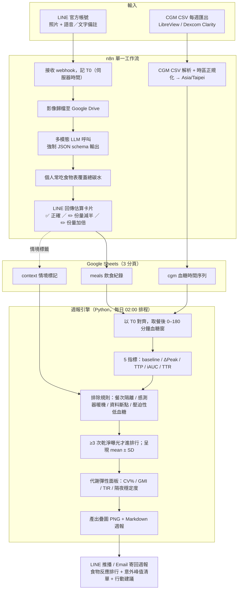
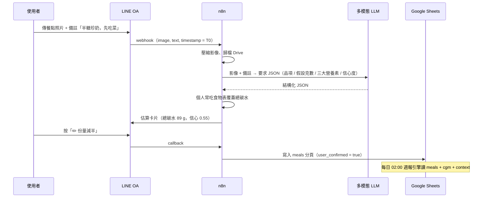

# Ai-to-Agent-CGM-v2

> 個人餐後血糖反應的「規律探測器」。
> 拍一張飲食照片 → 多模態 Agent 估營養素 → 對齊 CGM 血糖曲線 → 找出個人化關聯。
> **不追求克數精確**，目標是在 4–6 週內用乾淨資料點，找出「哪些食物／情境組合會造成非預期的血糖衝擊」，
> 並輸出可執行的飲食順序與餐後活動建議。與 Levels、Nutrisense 等平台同一套底層邏輯。

**定位規模：** 單人／家庭級原型。多人時儲存層需由 Google Sheets 換成正式資料庫。
**版本：** v2（方案一收斂版）—— LINE 前門 × n8n × Google Sheets × 週報 Python 引擎，4 週可上線。

---

## 目錄

- [1. 為什麼是這個架構](#1-為什麼是這個架構)
- [2. 方案一：系統架構](#2-方案一系統架構)
- [3. 元件選型與理由](#3-元件選型與理由)
- [4. 資料流（單餐時序）](#4-資料流單餐時序)
- [5. 臨床規格（指標定義）](#5-臨床規格指標定義)
- [6. 資料排除規則](#6-資料排除規則)
- [7. 代謝彈性面板](#7-代謝彈性面板)
- [8. 安全護欄](#8-安全護欄)
- [9. 資料結構](#9-資料結構)
- [10. 參考資料庫](#10-參考資料庫)
- [11. 4 週落地時程與驗收](#11-4-週落地時程與驗收)
- [12. v1 明確不做](#12-v1-明確不做)
- [13. 選型決策（已定案）](#13-選型決策已定案)
- [14. Repo 結構與執行](#14-repo-結構與執行)
- [15. 免責聲明](#15-免責聲明)

---

## 1. 為什麼是這個架構

整體五層拆解（輸入 → 運算 → 儲存 → 分析 → 輸出）正確，與實務上 CGM×飲食研究的資料管線一致
（Weizmann 個人化營養研究、Zoe、Levels 同一骨架）。方案一在此骨架上做三件事收斂：

1. **前門用 LINE 官方帳號**：一則訊息同時帶影像與備註，`T0`（用餐時間錨點）由 webhook 伺服器時間決定，不依賴 EXIF。
2. **運算層用 Gemini，先不接影像 SDK 鏈**：多模態 LLM 直接吃原圖並以 `responseSchema` 強制結構化輸出，數字用「個人常吃食物表」覆蓋高頻品項；完整營養資料庫 RAG 推遲到 v2。
3. **分析層集中為單一 Python 套件**：每個指標都有寫死的臨床定義與排除規則，易被醫師 code review、易加單元測試。

原藍圖的 4 個缺口，方案一的處理：

| 原缺口 | 方案一處理 |
|--------|-----------|
| CGM 資料如何進來 | 獨立輸入軌：每週手動匯出 CSV（LibreView / Dexcom Clarity）→ n8n 解析 |
| 時區未正規化 | n8n 入口統一轉 `Asia/Taipei`，時間戳為三分頁 join key |
| 營養數字無出處 | LLM 強制結構化輸出 + 個人常吃食物表覆蓋總碳水；v2 再接 USDA FDC / TFDA / GI 資料庫 |
| 干擾餐次污染排行 | 分析層餐次隔離 + 情境標籤 + ≥3 次乾淨曝光才進排行 |

---

## 2. 方案一：系統架構



---

## 3. 元件選型與理由

| 元件 | 方案一選擇 | 為什麼（v1） | 推遲到 v2+ |
|------|-----------|-------------|-----------|
| 拍照前門 | **LINE 官方帳號**（Messaging API webhook） | 台灣使用者零學習成本；一則訊息帶影像＋備註；`T0` 用伺服器時間，不依賴 EXIF；免寫 App | 專用 App；Google Drive 資料夾監看作備援 |
| 影像前處理 | 不接 ML Kit，**LLM 直接吃原圖**，僅伺服器端壓縮 | 少一個 SDK 依賴＝少一條維運線 | ML Kit Document Scanner（拍營養標示裁切）＋ Text Recognition OCR |
| 編排 | **n8n** 單一 workflow | 內建重試、錯誤分支、憑證管理；改流程不動程式碼 | 拆多 workflow、加佇列 |
| 食物 → 營養 | **一次多模態呼叫** ＋ 強制 JSON schema（每品項帶假設克數＋信心度）；再用**個人常吃食物表（30–50 筆手建）** 覆蓋總碳水 | 完整 RAG 是獨立工程；小表覆蓋高頻品項先拿 80% 效益 | USDA FoodData Central API ＋ 快取 TFDA 匯出 ＋ GI 資料庫查表 |
| 使用者確認 | LINE 回傳估算卡片，按鈕：✅正確／✏️份量減半／✏️份量加倍 | 一鍵校正比自由輸入好維護，且修掉最大宗誤差（份量） | 逐欄位編輯、語音修正 |
| 儲存 | **Google Sheets 3 分頁** | 單人多年資料量遠低於上限；零維運；醫師可直接看 | 多人時換 Postgres / BigQuery / InfluxDB |
| CGM | **每週手動匯出 CSV** 丟指定 Drive 資料夾 | 免處理 Dexcom OAuth／LibreLinkUp 非官方 API 的法遵與破 API 風險 | Dexcom 官方 API 自動拉取 |
| 分析 | **單一 Python 腳本**（pandas），每日排程 | 邏輯集中、易 code review、易加單元測試 | 服務化、即時分析 |
| 輸出 | 每週一份：食物反應表＋「意外峰值」清單＋3–5 張疊圖 | 週頻率對行為改變剛好；日報會焦慮 | 即時餐後回饋 |

---

## 4. 資料流（單餐時序）



---

## 5. 臨床規格（指標定義）

全專案單位固定 **`mg/dL`**。觀察窗採 **0–180 分鐘**（3 小時，非 2 小時），以免漏掉高油脂／高蛋白餐的延遲峰。

| 指標 | 定義 | 臨床判讀 |
|------|------|---------|
| 餐前基準 `baseline` | `[T0−15min, T0]` 內 CGM 讀值平均；需 ≥2 筆有效讀值，否則標記 `baseline_invalid` | — |
| 峰值增幅 `delta_peak` | `max(glucose, 0–180min) − baseline` | 單餐血糖衝擊；同一人 ΔPeak > 60 mg/dL 屬高反應餐 |
| 達峰時間 `time_to_peak` | `argmax − T0`（分鐘） | 快 30–45 min → 高 GI／精緻澱粉／含糖飲；慢 60–90 min+ → 油脂／蛋白／複合澱粉，胃排空慢 |
| 增量曲線下面積 `iauc` | 梯形法積分，**僅計基準以上面積（負值截 0，Wolever 法）**，單位 `mg/dL·min` | 整體葡萄糖暴露量；食物排行榜主指標 |
| 恢復時間 `time_to_recovery` | 首次 `glucose ≤ baseline + 10` 且持續 ≥15 min 的時間點 − T0；180 min 內未達 → `not_recovered_3h` | 反映胰島素敏感度；頻繁 `not_recovered_3h` 是就醫討論訊號 |
| 標準化反應 `delta_peak_per15` | `delta_peak × 15 / net_carb_g`；`net_carb_g < 5` 不標準化並標記 | 讓不同份量的同一食物可比較 |

> CGM 相對靜脈血糖有 5–15 分鐘生理延遲，週報須註明。

---

## 6. 資料排除規則

v1 從嚴，寧缺勿濫 —— 乾淨的少數資料點勝過有雜訊的排行榜。

| 規則 | 條件 | 處理 |
|------|------|------|
| 餐次隔離 | `[T0−180min, T0+180min]` 內有其他進食紀錄 | 標 `contaminated`，不進排行 |
| 感測器暖機 | 每個 `sensor_session` 前 24 小時 | 資料全數排除 |
| 資料斷點 | 觀察窗內 CGM 缺漏 > 20 分鐘 | 標 `gap`，不計 iAUC |
| 壓迫性低血糖 | 睡眠時段快速下降後快速回升的 V 型 | 標 `compression_low`，排除於隔夜穩定度計算 |
| 排行門檻 | 同一食物／餐型乾淨曝光 < 3 筆 | 標「初步觀察」，不列正式名次 |

**納入排行：** 同一食物／餐型需 **≥3 筆乾淨曝光**，呈現 mean ± SD。

---

## 7. 代謝彈性面板

不使用「代謝彈性（metabolic flexibility）」一詞（嚴格定義需 indirect calorimetry）。改用
**2019 國際 CGM 指標共識** 的可辯護指標，週報呈現本週數值與 4 週趨勢：

| 指標 | 說明 | 參考門檻 |
|------|------|---------|
| 平均血糖 Mean Glucose | 全期平均 | — |
| GMI | 由平均血糖估算之糖化血色素 | — |
| **CV%** | 血糖變異係數 = SD / Mean × 100 | **< 36% 為穩定** |
| SD | 血糖標準差 | — |
| TIR 70–180 | 目標範圍內時間佔比 | 一般目標 > 70% |
| TBR < 70 | 低血糖時間佔比 | < 4% |
| TAR > 180 | 高血糖時間佔比 | < 25% |
| 隔夜穩定度 | 00:00–06:00 平均與 CV | — |

---

## 8. 安全護欄

1. **明確聲明**：非醫療器材、非診斷、非個人化醫療建議；輸出僅為飲食型態觀察。
2. **低血糖事件另列**：偵測 < 70 mg/dL（Level 1）與 < 54 mg/dL（Level 2），獨立於餐後分析，於週報頂端提示。
3. **就醫訊號（只提示，不建議處置）**：餐前基準經常 > 130 mg/dL、多數餐 `not_recovered_3h`、TIR < 70%、或出現 Level 2 低血糖 → 週報標「建議與新陳代謝科醫師討論」。
4. **絕不**輸出任何藥物、胰島素劑量、生酮或極端斷食建議。
5. 涉及本人以外對象（學員／個案）→ 需書面同意書，且資料去識別化後才可彙整（符合個資法）。

---

## 9. 資料結構

### Google Sheets 分頁

**`meals`（飲食紀錄）**

| 欄位 | 型別 | 說明 |
|------|------|------|
| `meal_id` | ISO8601 (+08:00) | 主鍵，= `T0` |
| `t0` | ISO8601 (+08:00) | 用餐時間錨點（webhook 伺服器時間） |
| `note` | text | 使用者語音／文字備註原文 |
| `items_json` | JSON text | 品項明細（見下方 schema） |
| `carb_g` / `net_carb_g` / `protein_g` / `fat_g` / `fiber_g` | number | 總量（經個人常吃食物表覆蓋） |
| `gi_est` / `gl_est` | number | 推估值 |
| `eating_order` | enum | `veg_first` / `carb_first` / `mixed` / `unknown` |
| `post_meal_activity` | enum | `none` / `walk_10_15min` / `walk_30min+` / `unknown` |
| `confidence` | number 0–1 | 綜合信心度 |
| `user_confirmed` | bool | 是否經一鍵校正確認 |
| `image_url` | text | Drive 歸檔連結 |

**`cgm`（血糖時間序列）**

| 欄位 | 型別 | 說明 |
|------|------|------|
| `ts` | ISO8601 (+08:00) | 主鍵，時區正規化後 |
| `glucose_mgdl` | number | 血糖值（全專案統一 mg/dL） |
| `sensor_session` | string | 感測器 session id，用於暖機排除與去重 |
| `source` | enum | `libre` / `dexcom` |

**`context`（情境標記，每日一列）**

| 欄位 | 型別 | 說明 |
|------|------|------|
| `date` | date | 主鍵 |
| `sleep_hours` | number | 前一晚睡眠時數 |
| `stress_subjective` | enum | `low` / `mid` / `high` |
| `hrv` | number | 選填，若有裝置 |
| `notes` | text | 其他 |

三分頁以時間戳為 join key。n8n 入口一律轉 `Asia/Taipei`；`cgm` 以 `ts` + `sensor_session` 去重。

### LLM 輸出 JSON schema（示意）

```json
{
  "meal_id": "2026-08-31T12:40:00+08:00",
  "t0": "2026-08-31T12:40:00+08:00",
  "note": "半糖珍奶 + 雞腿便當，先吃菜，飯吃約 2/3",
  "items": [
    {
      "name": "白飯",
      "portion_g": 160,
      "portion_confidence": 0.55,
      "carb_g": 59,
      "net_carb_g": 58,
      "protein_g": 4,
      "fat_g": 0.4,
      "fiber_g": 0.8,
      "source": "personal_table"
    }
  ],
  "totals": { "carb_g": 92, "net_carb_g": 89, "protein_g": 30, "fat_g": 22, "fiber_g": 4 },
  "gi_est": 64,
  "gl_est": 57,
  "gi_confidence": 0.45,
  "eating_order": "veg_first",
  "post_meal_activity": "walk_10_15min",
  "user_confirmed": false
}
```

---

## 10. 參考資料庫

### 升糖指數（GI／GL）
| 來源 | 說明 |
|------|------|
| University of Sydney Glycemic Index Database（glycemicindex.com） | 官方 GI 查詢庫，逐項食物 GI 值 |
| International Tables of Glycemic Index and Glycemic Load Values（Atkinson 等，*Diabetes Care*） | 學術彙編表，含 GL；適合離線對照 |

### 食物營養成分
| 來源 | 說明 |
|------|------|
| 衛福部 TFDA 食品營養成分資料庫 | **本土菜色首選**，繁中品項齊全 |
| USDA FoodData Central（FDC） | 國際品項、加工食品、品牌資料完整，有 API |
| 包裝食品營養標示（OCR 擷取） | 現場最準，v2 接 ML Kit Text Recognition 後優先採用 |

### CGM 指標共識
| 來源 | 說明 |
|------|------|
| International Consensus on Time in Range（*Diabetes Care*, 2019） | TIR / TBR / TAR / CV% 定義與門檻 |

> v2 實作：離線建 GI 對照表 ＋ 呼叫 FDC API ＋ 快取 TFDA 匯出；Agent 只做「辨識 → 對應品項 → 帶份量查表」，數字全部有出處。

---

## 11. 4 週落地時程與驗收

| 週 | 交付 | Definition of Done |
|----|------|--------------------|
| W1 | LINE OA + n8n 骨架 + Sheets 3 分頁 + 時區統一 `Asia/Taipei` | 傳一張照片，30 秒內收到 LLM 估算卡片，資料落 `meals` 分頁 |
| W2 | LLM 結構化輸出 + 個人常吃食物表 + 一鍵校正 | 連續 20 餐，份量一鍵校正後總碳水誤差人工抽查 ≤ 20% |
| W3 | CGM CSV 解析 + Python 對齊引擎（5 指標 + 排除規則） | 給定一週資料，正確算出每筆乾淨餐的 5 指標，`contaminated` / `gap` 正確標記 |
| W4 | 週報引擎（疊圖 + 意外峰值清單 + 彈性面板）+ LINE 推播 | 產出第一份週報；醫師視角 review 指標定義與安全提示無誤 |

**第一個里程碑（W4 末）**：累積 ≥3 筆乾淨曝光的食物至少 5 種，週報能列出個人化排行與至少 1 條「意外峰值」觀察。

---

## 12. v1 明確不做

- 即時餐後回饋、專用 App、ML Kit 影像鏈。
- 完整 TFDA／USDA RAG、GI 資料庫全量查表。
- 干擾變數的迴歸建模（v1 只「打標籤 + 分層呈現」，不做因果推論）。
- 腸道菌、CGM 自動 API、多使用者。

---

## 13. 選型決策（已定案）

| 決策 | 選定 | 理由 |
|------|------|------|
| 拍照前門 | **LINE 官方帳號**（Messaging API webhook） | 台灣體驗最好；一則訊息帶影像＋備註；`T0` 用伺服器收訊時間，不依賴 EXIF |
| 多模態模型 | **Google Gemini**（`gemini-2.5-flash`，可由 `GEMINI_MODEL` 覆寫） | 原生多模態、支援 `responseSchema` 結構化輸出、成本低、與 Drive／Sheets 同生態 |
| CGM 裝置 | **Abbott FreeStyle Libre**（LibreView CSV 匯出） | 台灣普及；v1 走每週手動匯出，免處理非官方 API 的法遵與破 API 風險 |

v2 再評估：Dexcom 官方 API 自動拉取、ML Kit 影像鏈、營養資料庫 RAG。

---

## 14. Repo 結構與執行

```
Ai-to-Agent-CGM-v2/
├── README.md                     本文件（完整說明與架構）
├── LICENSE                       CC BY-SA 4.0
├── docs/
│   └── architecture-deck.html    五層架構總覽簡報（12 頁）
├── n8n/
│   ├── cgm-coach.workflow.json   可匯入的 n8n 工作流（LINE→Gemini→Sheets + CGM CSV）
│   └── README.md                 憑證、環境變數、節點說明、TODO
└── engine/
    ├── requirements.txt
    ├── config.example.yaml
    ├── README.md                 安裝與使用
    ├── cgm_coach/
    │   ├── align.py              ✅ T0 對齊、5 指標、排除規則（核心）
    │   ├── flexibility.py        ✅ CGM 共識指標面板、低血糖事件
    │   ├── report.py             🟡 Markdown 週報（可用）＋疊圖（待補）
    │   ├── libre.py              🟡 LibreView CSV 解析（骨架）
    │   ├── sheets.py             🟡 Google Sheets 讀寫（骨架）
    │   ├── config.py / cli.py    設定與進入點
    │   └── __main__.py
    └── tests/test_align.py       合成血糖曲線驗證指標與旗標
```

**n8n：** 匯入 `n8n/cgm-coach.workflow.json`，依 `n8n/README.md` 設定 2 個 Google 憑證與 6 個環境變數，LINE webhook 指向 `/webhook/line-webhook`。

**Python 引擎：**

```bash
cd engine
pip install -r requirements.txt
cp config.example.yaml config.yaml          # 填 sheet_id、服務帳號金鑰路徑
python -m pytest -q                          # 4 項測試
python -m cgm_coach import-libre <LibreView匯出.csv>
python -m cgm_coach weekly-report --since 2026-08-25 --until 2026-09-01
```

目前 `align.py` 與 `flexibility.py` 已完整實作並通過測試；`libre.py` / `sheets.py` / `report.plot_overlays` 為骨架，TODO 見各自 README。

---

## 15. 免責聲明

本專案為個人飲食型態的觀察工具，**非醫療器材、不提供醫療診斷或個人化醫療建議**。
所有輸出僅供了解自身飲食與血糖變化的趨勢參考。任何用藥、胰島素劑量或飲食療法調整，
請諮詢新陳代謝科或內分泌科醫師。健康資料依《個人資料保護法》處理；涉及本人以外對象需取得書面同意。

---

_文件版本：v2 · 方案一收斂版 · 2026-08_
